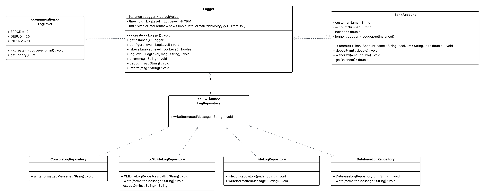

# Logger-Framework

A simple Java application demonstrating a `BankAccount` class with deposit, withdrawal, and balance inquiry
functionality, all instrumented with a configurable singleton `Logger`. Includes example usage in a `Main` class.

## Features

* **BankAccount**: Create accounts, deposit and withdraw funds, and check balances.
* **Logger**: Singleton logger with timestamped and leveled output, supporting five log levels (`CRITICAL`, `ERROR`,
  `ALARM`, `INFORM`, `DEBUG`).
* **LogLevel**: Enumeration defining severity-based priority filtering for log messages.
* **LogRepository**: Interface for pluggable backends (console, file, XML, database).
* **ConsoleLogRepository**, **FileLogRepository**, **XMLFileLogRepository**, **DatabaseLogRepository**: Built-in
  implementations.
* **Main**: Sample entry point showing logger configuration and account operations.

## Project Coordinates

* **Group ID**: `lk.ac.iit.asd.charindu`
* **Artifact ID**: `w2107144_7SENG004C_cw2`
* **Version**: `Q2`

## Prerequisites

* Java Development Kit (JDK) 17 or higher
* Apache Maven 3.x or higher
* Compatible IDE or command-line tools

## Installation & Compilation

This is a Maven-based project. Ensure you have Java (JDK 17+) and Apache Maven installed.

1. Clone or download the repository:

   ```bash
   git clone https://github.com/CharinduLiyanage/Logger-Framework.git
   cd Logger-Framework
   ```

2. Build and package (creates a fat, executable JAR):

   ```bash
   mvn clean package
   ```

   After a successful build, the shaded JAR will be located at:

   ```
   target/w2107144_7SENG004C_cw2-Q2.jar
   ```

## Dependencies

Managed via Maven (see `<dependencies>` in `pom.xml`):

* **H2 Database** (`com.h2database:h2:2.3.232`)

## Running the Demo

Execute the packaged JAR directly:

```bash
java -jar target/w2107144_7SENG004C_cw2-Q2.jar
```

Or run via Maven:

```bash
mvn exec:java -Dexec.mainClass="lk.ac.iit.asd.charindu.Main"
```

### Expected output (timestamps will vary):

```
[2025-05-18 14:23:45.123] [INFORM]  [12345] Account created for Alice
[2025-05-18 14:23:45.124] [DEBUG]   [12345] Deposited 500.0; new balance=1500.0
[2025-05-18 14:23:45.125] [DEBUG]   [12345] Withdrew 200.0; new balance=1300.0
[2025-05-18 14:23:45.126] [ERROR]   [12345] Invalid withdrawal amount: -50.0
```

The timestamp format is `yyyy-MM-dd HH:mm:ss.SSS`.

## Configuration

Before logging any messages, configure the `Logger`. You must supply the threshold level, whether logging is enabled,
and the repository backend:

```java
Logger.getInstance();

configure(LogLevel.DEBUG, true,new ConsoleLogRepository());
```

Available log levels (highest severity first):

* `CRITICAL`
* `ERROR`
* `ALARM`
* `INFORM`
* `DEBUG`

Messages below the configured threshold are ignored.

## Package Structure

```
Logger-Framework
├── pom.xml
└── src
    └── main
        └── java
            └── lk/ac/iit/asd/charindu
                ├── BankAccount.java
                ├── Logger.java
                ├── LogLevel.java
                ├── LogRepository.java
                ├── ConsoleLogRepository.java
                ├── FileLogRepository.java
                ├── XMLFileLogRepository.java
                ├── DatabaseLogRepository.java
                └── Main.java
```

## Class Diagram


