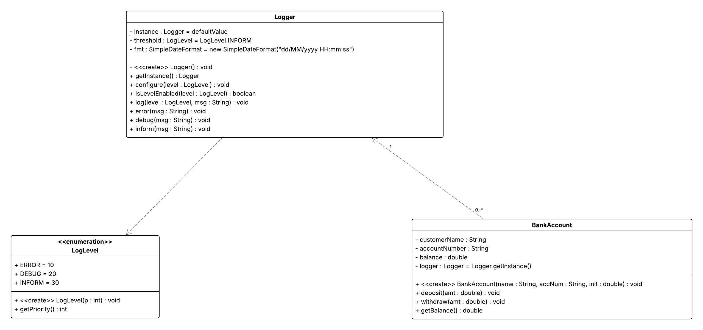

# Logger-Framework

A simple Java application demonstrating a `BankAccount` class with deposit, withdrawal, and balance inquiry functionality, all instrumented with a configurable singleton `Logger`. Includes example usage in a `Main` class.

## Features

* **BankAccount**: Create accounts, deposit and withdraw funds, and check balances.
* **Logger**: Singleton logger with timestamped output, supporting three log levels (`ERROR`, `DEBUG`, `INFORM`).
* **LogLevel**: Enumeration defining severity-based priority filtering for log messages.
* **Main**: Sample entry point showing logger configuration and account operations.

## Package Structure

```plaintext
Logger-Framework
├── pom.xml
└── src
    └── main
        └── java
            └── lk/ac/iit/asd/charindu
                ├── BankAccount.java
                ├── Logger.java
                ├── LogLevel.java
                └── Main.java
```

## Prerequisites

* **Project Coordinates**: `lk.ac.iit.asd.charindu:w2107144_7SENG004C_cw2:Q1`
* Java Development Kit (JDK) 17 or higher
* Apache Maven 3.x or higher
* Compatible IDE or command-line tools

## Installation & Compilation

This is a Maven-based project. Ensure you have Java (JDK 17+) and [Apache Maven](https://maven.apache.org/) installed.

1. Clone or download the repository:

   ```bash
   git clone https://github.com/CharinduLiyanage/Logger-Framework.git
   cd Logger-Framework
   ```

2. Build and package (creates a fat, executable JAR):

   ```bash
   mvn clean package
   ```

   After a successful build, the shaded JAR will be located at:

   ```plaintext
   target/w2107144_7SENG004C_cw2-Q1.jar
   ```

## Running the Demo

Execute the packaged JAR directly:

```bash
java -jar target/w2107144_7SENG004C_cw2-Q1.jar
```

Alternatively, run via Maven:

```bash
mvn exec:java -Dexec.mainClass="lk.ac.iit.asd.charindu.Main"
```

**Expected output:**

```
[INFORM] [dd/MM/yyyy HH:mm:ss] [12345] Account created for Alice
[INFORM] [dd/MM/yyyy HH:mm:ss] [12345] Deposited 500.0; new balance=1500.0
[INFORM] [dd/MM/yyyy HH:mm:ss] [12345] Withdrew 200.0; new balance=1300.0
[ERROR]  [dd/MM/yyyy HH:mm:ss] [12345] Withdrawal amount must be positive
```

> *Note:* The timestamp format is `dd/MM/yyyy HH:mm:ss`.

## Configuration

By default, the `Logger` is configured to `INFORM` level in `Main.java`. To change the verbosity:

```java
Logger.getInstance().configure(LogLevel.DEBUG);
```

Available log levels (lowest priority to highest):

* `ERROR`
* `DEBUG`
* `INFORM`

Messages with a priority value higher than the configured threshold will be ignored.

## Class Diagram


