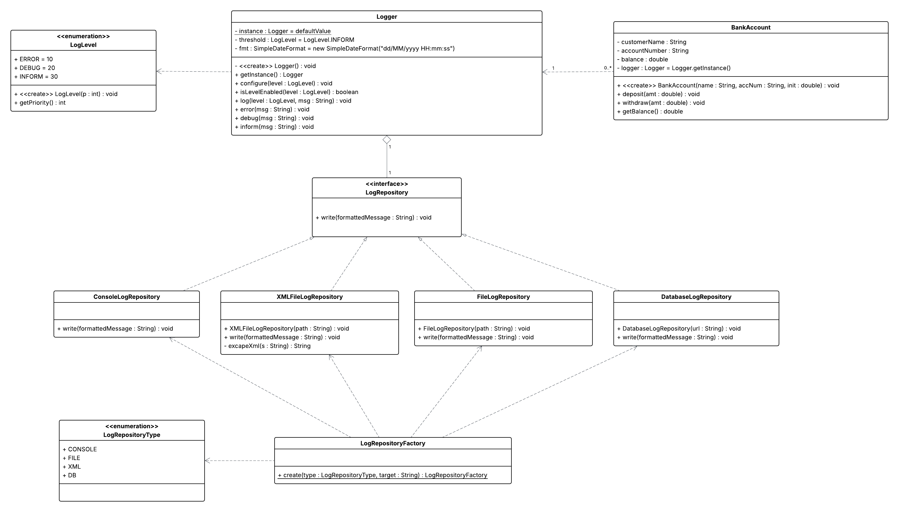

# Logger-Framework

A simple Java application demonstrating a `BankAccount` class with deposit, withdrawal, and balance inquiry functionality, all instrumented with a configurable singleton `Logger`. You can use the provided `Main` class for a quick demo or wire up repositories dynamically via the `LogRepositoryFactory` and `LogRepositoryType` enum.

## Features

* **BankAccount**: Create accounts, deposit and withdraw funds, and check balances.
* **Logger**: Singleton logger with timestamped and leveled output, supporting five log levels (`CRITICAL`, `ERROR`, `ALARM`, `INFORM`, `DEBUG`).
* **LogLevel**: Enumeration defining severity-based priority filtering for log messages.
* **LogRepository**: Interface for pluggable backends (console, file, XML, database).
* **ConsoleLogRepository**, **FileLogRepository**, **XMLFileLogRepository**, **DatabaseLogRepository**: Built-in implementations.
* **LogRepositoryType**: Enum listing all supported backends (`CONSOLE`, `FILE`, `XML`, `DB`).
* **LogRepositoryFactory**: Factory for instantiating `LogRepository` implementations by type with an optional target (file path or JDBC URL).
* **Main**: Sample entry point showing logger configuration and account operations across each backend.

## Factory Usage Example

Use the factory when you want to select a repository at runtime based on configuration:

```java
import lk.ac.iit.asd.charindu.*;

public class App {
    public static void main(String[] args) {
        // Create a File repository via the factory
        LogRepository repo = LogRepositoryFactory.create(
            LogRepositoryType.FILE,
            "app.log"
        );

        // Configure the singleton Logger
        Logger.getInstance()
              .configure(LogLevel.DEBUG, true, repo);

        // Use BankAccount as usual
        BankAccount acct = new BankAccount("Bob", "67890", 500);
        acct.deposit(100);
        acct.withdraw(50);
    }
}
```

## Project Coordinates

* **Group ID**: `lk.ac.iit.asd.charindu`
* **Artifact ID**: `w2107144_7SENG004C_cw2`
* **Version**: `Q3`

## Prerequisites

* Java Development Kit (JDK) 17 or higher
* Apache Maven 3.x or higher
* Compatible IDE or command-line tools

## Installation & Compilation

This is a Maven-based project. Ensure you have Java (JDK 17+) and Apache Maven installed.

1. Clone or download the repository:

   ```bash
   git clone https://github.com/CharinduLiyanage/Logger-Framework.git
   cd Logger-Framework
   ```

2. Build and package (creates a fat, executable JAR):

   ```bash
   mvn clean package
   ```

   After a successful build, the shaded JAR will be located at:

   ```
   target/w2107144_7SENG004C_cw2-Q3.jar
   ```

## Dependencies

Managed via Maven (see `<dependencies>` in `pom.xml`):

* **H2 Database** (`com.h2database:h2:2.3.232`)

## Running the Demo

Execute the packaged JAR directly:

```bash
java -jar target/w2107144_7SENG004C_cw2-Q3.jar
```

Or run via Maven:

```bash
mvn exec:java -Dexec.mainClass="lk.ac.iit.asd.charindu.Main"
```

### Expected Output (timestamps will vary)

```
[2025-05-18 14:23:45.123] [INFORM]  [12345] Account created for Alice
[2025-05-18 14:23:45.124] [DEBUG]   [12345] Deposited 500.0; new balance=1500.0
[2025-05-18 14:23:45.125] [DEBUG]   [12345] Withdrew 200.0; new balance=1300.0
[2025-05-18 14:23:45.126] [ERROR]   [12345] Invalid withdrawal amount: -50.0
```

The timestamp format is `yyyy-MM-dd HH:mm:ss.SSS`.

## Configuration

Before logging any messages, configure the `Logger` singleton with:

```java
Logger.getInstance().configure(LogLevel.INFORM, true,LogRepositoryFactory(LogRepositoryType.CONSOLE, ""));
```

Available log levels (highest severity first):

* `CRITICAL`
* `ERROR`
* `ALARM`
* `INFORM`
* `DEBUG`

Messages below the configured threshold are ignored.

## Package Structure

```
Logger-Framework
├── pom.xml
└── src
    └── main
        └── java
            └── lk/ac/iit/asd/charindu
                ├── BankAccount.java
                ├── Logger.java
                ├── LogLevel.java
                ├── LogRepository.java
                ├── ConsoleLogRepository.java
                ├── FileLogRepository.java
                ├── XMLFileLogRepository.java
                ├── DatabaseLogRepository.java
                ├── LogRepositoryType.java
                ├── LogRepositoryFactory.java
                └── Main.java
```

## Class Diagram


